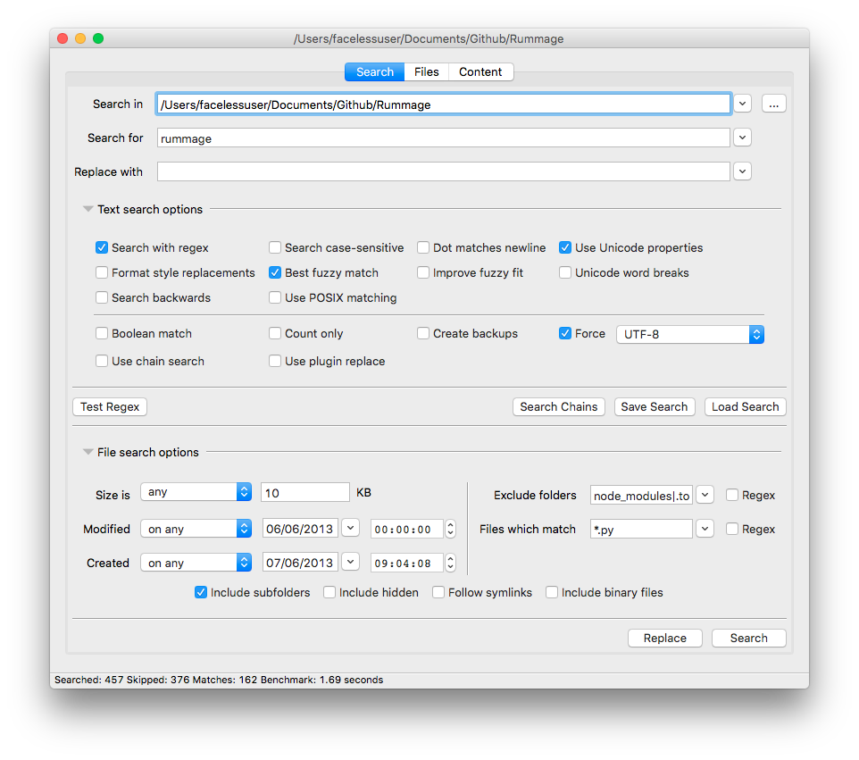

[![Unix Build Status][travis-image]][travis-link]
[![Coverage][codecov-image]][codecov-link]
[![Requirements Status][requires-image]][requires-link]
[![pypi-version][pypi-image]][pypi-link]
![License][license-image-mit]

Rummage
=======

Rummage is a cross platform search and replace tool written in Python. Rummage crawls directories and searches for specified patterns (either regular expression or literal) and can optionally replace those targets with desired text.

Windows has always had decent search and replace GUI tools, but at the time, it was difficult to find a decent one for macOS and Linux. Rummage was created to fill that void and is available on Linux, macOS, and Windows.

Rummage is written in Python and is currently available on Python 3.4+. Rummage by default uses the Python's Re regular expression engine, but you can also use the fantastic, feature rich [Regex](https://pypi.python.org/pypi/regex) search engine and do interesting things like fuzzy searching and more.

In general, it is usually preferable to specify an encoding for Rummage to use, but if you don't, Rummage will attempt encoding detection via the default, slower [Chardet](https://pypi.python.org/pypi/chardet) or the optional, faster [cChardet](https://pypi.python.org/pypi/cchardet/) depending on what is installed on your system (Chardet is installed by default with Rummage as it is pure Python). When replacing, it is usually recommended to specify the encoding to ensure the replace is done with the correct encoding.

## Screenshots

# Documentation

http://facelessuser.github.io/Rummage/

License
=======

Rummage is released under the MIT license.

Copyright (c) 2013 - 2018 Isaac Muse <isaacmuse@gmail.com>

Permission is hereby granted, free of charge, to any person obtaining a copy of this software and associated documentation files (the "Software"), to deal in the Software without restriction, including without limitation the rights to use, copy, modify, merge, publish, distribute, sublicense, and/or sell copies of the Software, and to permit persons to whom the Software is furnished to do so, subject to the following conditions:

The above copyright notice and this permission notice shall be included in all copies or substantial portions of the Software.

THE SOFTWARE IS PROVIDED "AS IS", WITHOUT WARRANTY OF ANY KIND, EXPRESS OR IMPLIED, INCLUDING BUT NOT LIMITED TO THE WARRANTIES OF MERCHANTABILITY, FITNESS FOR A PARTICULAR PURPOSE AND NONINFRINGEMENT. IN NO EVENT SHALL THE AUTHORS OR COPYRIGHT HOLDERS BE LIABLE FOR ANY CLAIM, DAMAGES OR OTHER LIABILITY, WHETHER IN AN ACTION OF CONTRACT, TORT OR OTHERWISE, ARISING FROM, OUT OF OR IN CONNECTION WITH THE SOFTWARE OR THE USE OR OTHER DEALINGS IN THE SOFTWARE.

[travis-image]: https://img.shields.io/travis/facelessuser/Rummage/master.svg?label=Unix%20Build
[travis-link]: https://travis-ci.org/facelessuser/Rummage
[license-image]: https://img.shields.io/badge/license-MIT-blue.svg
[codecov-image]: https://img.shields.io/codecov/c/github/facelessuser/Rummage/master.svg
[codecov-link]: http://codecov.io/github/facelessuser/Rummage?branch=master
[requires-image]: https://img.shields.io/requires/github/facelessuser/Rummage/master.svg
[requires-link]: https://requires.io/github/facelessuser/Rummage/requirements/?branch=master
[pypi-image]: https://img.shields.io/pypi/v/Rummage.svg
[pypi-link]: https://pypi.python.org/pypi/Rummage
[license-image-mit]: https://img.shields.io/badge/license-MIT-blue.svg
