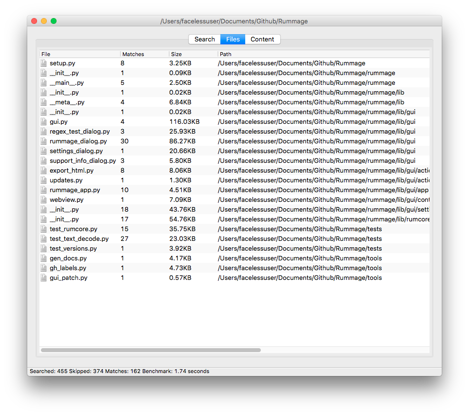

[![Unix Build Status][travis-image]][travis-link]
[![Code Health][landscape-image]][landscape-link]
[![Coverage][codecov-image]][codecov-link]
[![Requirements Status][requires-image]][requires-link]
![License][license-image]

Rummage
=======

Rummage is a cross platform search and replace tool for Python 2.7 and Python 3.4+. It crawls directories and searching for specified patterns and can optionally replace those targets with desired text. Rummage allows for literal or regular expression searches.

Rummage was inspired by the tool [grepWin][grepwin] and was created to provide a suitable GUI search and replace tool for macOS and Linux due to a lack of decent offerings available at the time, but is available on Windows, macOS, and Linux.

Rummage is written in Python; therefore, it will be slower on searches than it would be if the searching were written in C/C++. If you specify a file encoding when searching large projects, it should perform quite reasonably as it won't have to guess the encoding of files (which is the biggest bottleneck). On small projects, encoding guessing isn't too bad, but [Chardet][chardet] (which is what Rummage uses to guess encoding), is not the fastest as it is not written in C/C++ either.

Rummage by default uses the Python's Re regular expression engine, but you can also use the fantastic [Regex][regex] search engine and do interesting things like fuzzy searching.

## Screenshots

# Documentation
http://facelessuser.github.io/Rummage/

License
=======

Rummage is released under the MIT license.

Copyright (c) 2013 - 2017 Isaac Muse <isaacmuse@gmail.com>

Permission is hereby granted, free of charge, to any person obtaining a copy of this software and associated documentation files (the "Software"), to deal in the Software without restriction, including without limitation the rights to use, copy, modify, merge, publish, distribute, sublicense, and/or sell copies of the Software, and to permit persons to whom the Software is furnished to do so, subject to the following conditions:

The above copyright notice and this permission notice shall be included in all copies or substantial portions of the Software.

THE SOFTWARE IS PROVIDED "AS IS", WITHOUT WARRANTY OF ANY KIND, EXPRESS OR IMPLIED, INCLUDING BUT NOT LIMITED TO THE WARRANTIES OF MERCHANTABILITY, FITNESS FOR A PARTICULAR PURPOSE AND NONINFRINGEMENT. IN NO EVENT SHALL THE AUTHORS OR COPYRIGHT HOLDERS BE LIABLE FOR ANY CLAIM, DAMAGES OR OTHER LIABILITY, WHETHER IN AN ACTION OF CONTRACT, TORT OR OTHERWISE, ARISING FROM, OUT OF OR IN CONNECTION WITH THE SOFTWARE OR THE USE OR OTHER DEALINGS IN THE SOFTWARE.

[travis-image]: https://img.shields.io/travis/facelessuser/Rummage/master.svg?label=Unix%20Build
[travis-link]: https://travis-ci.org/facelessuser/Rummage
[license-image]: https://img.shields.io/badge/license-MIT-blue.svg
[landscape-image]: https://landscape.io/github/facelessuser/Rummage/master/landscape.svg?style=flat
[landscape-link]: https://landscape.io/github/facelessuser/Rummage/master
[codecov-image]: https://img.shields.io/codecov/c/github/facelessuser/Rummage/master.svg
[codecov-link]: http://codecov.io/github/facelessuser/Rummage?branch=master
[requires-image]: https://img.shields.io/requires/github/facelessuser/Rummage/master.svg
[requires-link]: https://requires.io/github/facelessuser/Rummage/requirements/?branch=master
