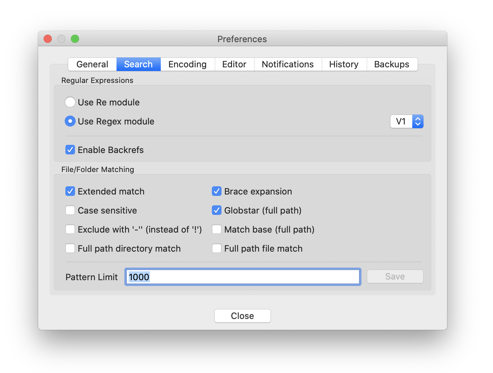
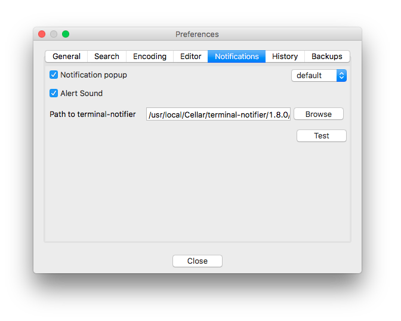
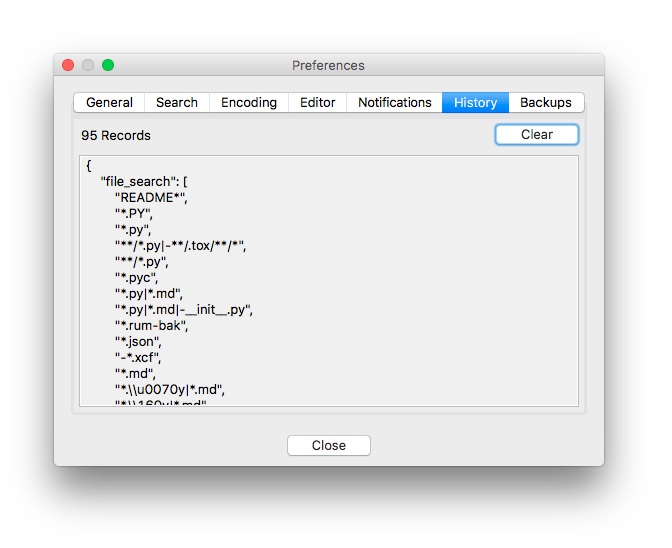
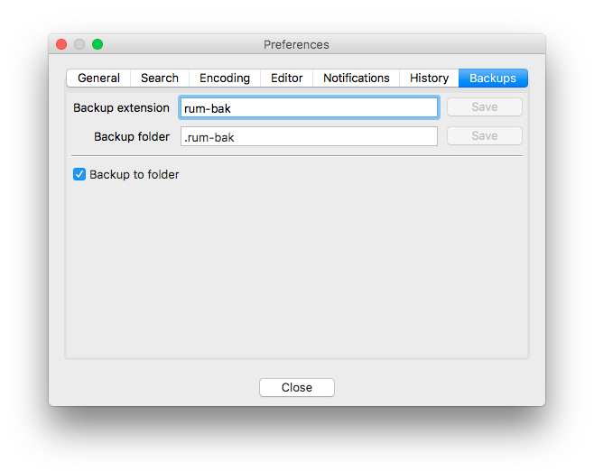

# Settings

## Overview

The preference dialog is found in the menu at **File-->Preferences** and contains all of the global options that can be controlled for the editor.

## General


The **General** tab contains a couple of useful settings.

Single Instance
: 
    By default, Rummage will allow for multiple windows to be open.  If this option is enabled, the first window will be be the only window to open.  All subsequent instances will pass their arguments to the first and close without showing a window.

Language
: 
    Rummage has internal support to display dialog labels in different languages. Currently Rummage has English. Russian is outdated but includes a fair bit of the needed translations. See [Localization](./extras.md#localization) to learn more about improving current translations or adding additional translations.

Updates
: 
    Controls whether Rummage will check for new updates daily and allows controlling whether you want to be notified of prereleases as well. A button has also been provided to check for updates right away after configuring your update settings.

    The check is only a check for new versions and doesn't perform an upgrade.  Rummage must be upgraded via `pip` from command line.

    !!! info "Update Issues: Python 3.6+ on macOS"
        There is a small issue on macOS with Python 3.6+: Python 3.6 changed how it gets the default certificates required to properly check URLs. The details are actually documented here: https://bugs.python.org/issue28150#msg276516.

        To get access again to the default certificates is actually quite easy. Assuming that Python 3.6+ was installed using the macOS installer from Python.org, you just need to navigate to `/Applications/Python 3.6/Install Certificates.command` and double click the command.  The script will use `pip` to install `certifi` and creates a symlink in the OpenSSL directory to `certifi`'s installed bundle location. If you are using something like macports, then you'll probably have to research to find out how to do the same thing.

International Time
: 
    Rummage displays file creation and modified time in the form `Jul 01, 2018, 03:00:00 AM`, but you can enable this option to display the times in international format: `2018-07-01 03:00:00`.

## Search



The **Regular Expression Modules** panel is where the desired regular expression engine that Rummage uses can be selected and configured.  By default, Rummage will use Re, but if the Regex module is installed in your Python installation, it can be selected instead.  There is also the option of using Re or Regex with [Backrefs](./search.md#backrefs) (a wrapper that adds a couple of special escapes and features).

If using Regex, you can set it to the version of your choice. `V0` tries to be completely compatible with Re patterns with non-breaking additional features, while `V1` breaks compatibility with Re and adds even more useful features. Please see [Regex documentation][regex] to learn more.

Under **File/Folder Matching** are a number options for file and folder matching patterns. Follow the links to learn more about each feature:

- [Extended match](./search.md#extended-match-syntax).
- [Brace expansion](./search.md#brace-expansion-syntax).
- Case sensitive for [wildcard match](./search.md#wildcard) and for [regular expression match](#regular-expression).
- [Globstar](./search.md#full-path-matching).
- [Match base](./search.md#full-path-matching).
- [Full path directory matching](./search.md#full-path-matching).
- [Full path file matching](./search.md#full-path-matching).

## Encoding


The **Encoding** panel is where you can tweak encoding detection. You can change the default encoding detection used (assuming you have both Chardet and cChardet installed). By default, Rummage will use the fastest (cChardet).

Special encoding file type considerations are also exposed here. File extensions assigned to either HTML, XML, or Python will use special logic to look for encoding declarations in the file's header, while file extensions assigned to binary will shortcut the encoding selection to binary. Just double click the file type whose extensions you would like to modify.

Remember that encoding detection is far from bulletproof and can pick an incorrect encoding. While during searches it might not be as big an issue, it is strongly suggested you use a forced encoding when performing replaces.

## Editor


The **Editor** panel allows you to configure the editor that will be used to open files.  To setup, simply enter the path to the editor and the options it should be called with. Once done, press the save button.

As noted in the image above, Rummage provides 3 special variables that can be used to insert the file name, line number, or column number.

Argument Variables | Description
------------------ | -----------
`{$file}`          | Insert the file name.
`{$line}`          | Insert the line number.
`{$col}`           | Insert the column number.

## Notifications



The **Notification** panel controls enabling/disabling and configuration of notifications.  You can enable/disable visual notifications and/or audible notification sounds.

You can also select whether to use the system's built-in notifications or Growl.

A test button is provided to test the configuration once set.

Ubuntu
: 
   - Growl: [Support for Linux][growl-linux].
   - Native: OSD via `notify-send`.

    !!! info "Other Distros"
        Though Rummage should run on any Linux distro, the native dialog option was built around Ubuntu's native notifications called OSD.  Notifications will not work on other distros that do not use OSD *unless* they use Growl.  Even without Growl, other distros will probably still get the audible cue, but as each distro varies, it is difficult to be certain.  As notifications are not crucial to usage, this is minor concern.

macOS
: 
    - Growl: [Support for macOS][growl-macos].
    - Native: Notification Center via [terminal-notifier][terminal-notifier]. Path to `terminal-notifier` must be configured.

    !!! info "Configuring macOS Native"
        When selecting `native` on macOS, an option to select the path to terminal notifier will be available since native dialogs rely on `terminal-notifier` to send notifications to the Notification Center. This must be configured or *native* notifications will not work.

        When selecting the `terminal-notifier` path, you can select either the binary directly or the `.<app` bundle (depending on how you installed `terminal-notifier`).  When selecting the `.app` bundle, Rummage will know how to access the binary inside the bundle.

Windows
: 
    - Growl: [Support for Windows][growl-win].
    - Native: Native windows taskbar notifications.


## History



The **History** panel is where all text box, drop down history can be cleared.

## Backups



The **Backups** panel allows you to configure where Rummage creates backups. You can control whether backups are all placed in the same folder as the original source, or if they are put into a subfolder. You can also configure the name of the subfolder used or the extension used when not writing to a subfolder.

## Import/Export Settings

If desired, Rummage's settings can be exported to a JSON file or imported from a JSON file.  This can be particularly useful for importing regular expression patterns from one system into another system's existing regular expression list. This can also be useful if you have a lot of regular expression patterns you wish to create, and it would be too cumbersome to do it through the GUI.  In the latter case, you could construct the pattern configurations in a JSON file and import all the patterns in one shot.

Import and export are broken up into three types of settings: general settings, chains, and searches. General settings are the basic feature configurations for Rummage.  Chains contains all of your configured pattern chains.  And searches is the actual configured search and replaces.  When exporting, you will be presented with a dialog allowing you to select which categories of settings you wish to export.


When importing, you will be prompted to select the settings file to import.  Then you will be asked to select one or more settings categories to import.  Rummage will skip any malformed or invalid settings. If you are going to overwrite an existing chain or search, it will prompt you whether to proceed with the overwrite.  Afterwards, it will output the import results in the text box.


The general settings are meant to be transferred between installations, not specifically configured by hand, so all the supported settings will not be covered here, but the chain and search format will be discussed in details.

The chain format for importing is shown below:

```js
{
    "chains": {                 // The key that denotes this setting is the "chains" setting.
        "a-chain": [            // Unique chain ID.  Must be composed of letters, numbers, underscores, and hyphens.
            "example-1",        // A list of references to specific unique search IDs.
            "example-2"
        ],
        "another-chain": [
            "example-3",
            "example-4"
        ]
    }
}
```

The search/replace format for importing is show below:

```js
{
    "saved_searches": {                                         // The key that denotes this setting is the "chains" setting.
        "Copyright-update": {                                   // Unique search ID.  Must be composed of letters, numbers, underscores, and hyphens.
            "flags": "is",                                      // Search and replace flags (covered below).
            "is_function": false,                               // Boolean stating whether the replace pattern is a function or not.
            "is_regex": true,                                   // Boolean stating whether the search pattern is a regular expression or literal string.
            "name": "Copyright update",                         // A more user friendly name or description of the pattern.
            "replace": "\\g<1>16",                              // The replace pattern, or in case `is_function` is `true`, the path to the Python replace plugin file.
            "search": "(Copyright \\(c\\) \\d+ - 20)(\\d{2})"   // The search pattern.
        }
    }
}
```

Below is a table containing valid flags for the `flags` parameter.  Literal searches only allow flags `i`, `u`, and `f`.  Regular expression patterns can use `i`, `u`, `f`, `s`, `b`, `e`, `w`, `r`, `p`, and `F` (though flags are applicable depending on whether you are using Re, Regex, or one of the two with Backrefs).

Flags | Supported\ Libraries                       | Option
----- | ------------------------------------------ | -----------
`i`   | All                                        | [Search case-sensitive.](./search.md#common-options)
`u`   | All                                        | [Use Unicode properties.](./search.md#common-options)
`s`   | All                                        | [Dot matches newline.](./search.md#common-options)
`f`   | Regex, Regex\ + \Backrefs                  | [Full case-folding.](./search.md#regex-options)
`b`   | Regex, Regex\ + \Backrefs                  | [Best fuzzy match.](./search.md#regex-options)
`e`   | Regex, Regex\ + \Backrefs                  | [Improve fuzzy fit.](./search.md#regex-options)
`w`   | Regex, Regex\ + \Backrefs                  | [Unicode word breaks.](./search.md#regex-options)
`r`   | Regex, Regex\ + \Backrefs                  | [Search backwards.](./search.md#regex-options)
`p`   | Regex, Regex\ + \Backrefs                  | [Use POSIX matching.](./search.md#regex-options)
`F`   | Regex, Regex\ + \Backrefs, Re\ + \Backrefs | [Format style replacements.](./search.md#common-options)

--8<-- "refs.txt"
