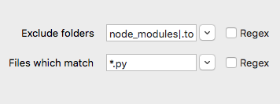

# Search Features

## Search Options

Rummage supports the default regular expression library ([Re][re]) that comes with Python and the 3rd party [Regex][regex] library, and though the basic syntax and features are similar between the two, Regex provides many additional features, some of which causes the syntax to deviate greatly from Re. If you are using Re, you will not see all the options shown below. Please check out documentation for whichever engine you have chosen to learn more about its specific feature set. This documentation will only briefly cover the features that can be enabled in each engine.

### Common Options

Both the Re and Regex engine have a couple of shared flags that are exposed in Rummage as checkboxes. These checkboxes are found directly under the search and replace text boxes.

Toggle                      | Description
--------------------------- | -----------
Search\ with\ regex         | Alters the behavior of `Search for` and `Replace with`.  When this is checked, both text boxes require regular expression patterns opposed to literal string.
Search\ case-sensitive      | Forces the search to be case-sensitive.
Dot\ matches\ newline       | `.` will also match newlines.
Use\ Unicode\ properties    | Changes the behavior of `\w`, `\W`, `\b`, `\B`, `\d`, `\D`, `\s`, and `\S` to use use characters from the Unicode property database (will also modify `\l`, `\L`, `\c`, and `\C` in search patterns if using Backrefs with Re).
Format\ style\ replacements | Replace pattern will use [a string replace format][format-string] for replace. `#!py3 "{1} {1[-2]} {group_name[-3]}"` etc. This is not available for Re without Backrefs, and is limited when using Re with Backrefs. Read more about format mode [here][backrefs-format]. And remember that Rummage normalizes differences in Backrefs' and Regex's handling of back slash escapes in format replace mode.

### Regex Engine Options

If the Regex engine is being used for regular expressions, a couple of extra checkboxes will be available. Regex can be run in either `VERSION0` or `VERSION1` mode.

`VERSION0` is compatible with Re regular expression patterns and has the extra `fullcase` toggle. `VERSION1` does not have this toggle as it is enabled by default and can only be disabled inline via a pattern with `(?-f)`. `VERSION1` is not directly compatible with Re patterns as it adds a number of changes to the syntax allowing for more advanced search options.

Toggle                      | Description
--------------------------- | -----------
Best\ fuzzy\ match          | If performing a fuzzy match, the *best* fuzzy match will be used.
Improve\ fuzzy\ fit         | Makes fuzzy matching attempt to improve the fit of the next match that it finds.
Unicode\ word\ breaks       | Will use proper Unicode word breaks and line separators when Unicode is enabled. See Regex documentation for more info.
Use\ POSIX\ matching        | Use the POSIX standard for regular expression, which is to return the leftmost longest match.
Search\ backwards           | Search backwards. The result of a reverse search is not necessarily the reverse of a forward search.
Full\ case-folding          | Use full case folding. For Regex `V0` only as it is enabled by default for `V1`.

### Rummage Options

Rummage has a couple of flags that are not specific to the regular expression engine.

Toggle                  | Description
----------------------- | -----------
Boolean\ match          | Will check each file up until the first match and will halt searching further.  No line context info will be gathered or displayed. Does not apply when performing replaces.
Count\ only             | Will just count the number of matches in the file and will not display line context information. This has no effect when applying replaces.
Create\ backups         | On replace, files with matches will be backed up before applying the replacements; backup files will have the `.rum-bak` extension.
Force\ &lt;encoding&gt; | Forces all files to be opened with the specified encoding opposed to trying to detect the encoding.  Encoding is hard and slow, so this is the preferred method for fast searches.  On failure, binary will be used instead.
Use\ chain\ search      | Puts Rummage into ["search chain" mode](./usage.md#search-chains). When in "search chain" mode, rummage will only use saved search chains for search and replace.
Use\ replace\ plugin    | When enabled, Rummage will use a [replace plugin](./usage.md#replace-plugins) instead of a replace pattern in order to do more advanced replaces.

!!! tip "Encoding Guessing"

    It is always recommended, if you know the encoding, to use `Force encoding` as it will always be the fastest. Encoding guessing can be slow and not always accurate.

    Encoding guessing is performed by `chardet` which is a pure Python library and is, by far, the slowest option.  If you manually install `cChardet`, you will have a much faster guessing experience.

## File Patterns



Wildcard patterns are the default for file and folder exclude patterns, but regular expression patterns can be used instead by selecting the `Regex` checkbox beside the pattern. Wildcard patterns and regular expression patterns will each be covered separately.

### Wildcard

Rummage uses file patterns and folder excludes to filter which files are searched. The default is to use wild card patterns modeled after `fnmatch` and `glob`. Below is a list of the syntax that is accepted, but not all features are enabled by default.

If you would prefer regular expression file patterns, please see [Regular Expression](#regular-expression) file patterns.

- File patterns are case insensitive by default, even for Linux/Unix systems. Case sensitivity can be enabled in [Preferences](./preferences.md#search).
- Slashes are generally treated as normal characters, but on windows they will be normalized: `/` will become `\\`. There is no need to explicitly use `\\` in patterns on Windows, but if you do, it will be handled.
- `.` is always matched by `*`, `?`, and `[]`. Enable searching of hidden files in the file search options of the [**Search** tab](./usage.md#configuring-file-search).

#### Basic Wildcard syntax

Rummage uses the [`wcmatch`][wcmatch] library to implement a specialized version of [`fnmatch`][wcmatch-fnmatch] wildcard patterns for file name matching.

Pattern           | Meaning
----------------- | -------
`*`               | Matches everything.
`?`               | Matches any single character.
`[seq]`           | Matches any character in seq.
`[!seq]`          | Matches any character not in seq.
`[[:alnum:]]`     | POSIX style character classes inside sequences. The `C` locale is used for byte strings and Unicode properties for Unicode strings. See [POSIX Character Classes][posix] in `wcmatch`'s documentation for more info.
`\`               | Escapes characters. If applied to a meta character, it will be treated as a normal character.
`|`               | Multiple patterns can be provided by separating them with `|`.
`-`               | If `-` is found at the start of a pattern, it will match the inverse.
`\xhh`            | By specifying `\x` followed by the hexadecimal byte value, you can specify characters directly.
`\uhhhh`          | By specifying `\u` with the four value hexadecimal character value, you can specify Unicode characters directly.
`\Uhhhhhhhh`      | By specifying `\U` with the eight value hexadecimal character value, you can specify wide Unicode characters directly.
`\N{name}`        | By specifying `\N{name}`, where `name` is a valid Unicode character name, you can specify Unicode characters directly.
`\a`              |  ASCII Bell (BEL).
`\b`              |  ASCII Backspace (BS).
`\f`              |  ASCII Formfeed (FF).
`\n`              |  ASCII Linefeed (LF).
`\r`              |  ASCII Carriage Return (CR).
`\t`              |  ASCII Horizontal Tab (TAB).
`\v`              |  ASCII Vertical Tab (VT).


!!! example "Example Patterns"

    Used in the `Files which match` box, this would match all Python files of `.py` extensions excluding `__init__.py`:

    ```
    *.py|-__init__.py
    ```

    Used in the `Files which match` box, this would match any file type that is not `.py`.

    ```
    -*.py
    ```

    Used in the `Exclude folders`, this would exclude all folders with `name` followed by a single digit, except `name3` which we will always be included.

    ```
    name[0-9]|-name3
    ```

    Used in the `Exclude folders`, this would exclude all folders except `name3`.

    ```
    -name3
    ```

    If you need to escape `-` or `|`, you can put them in a sequence: `[-|]`. Remember to place `-` at the beginning of a sequence as `-` is also used to specify character ranges: `[a-z]`.

#### Extended Match Syntax

In [Preferences](./preferences.md#search), you can also enable extended match patterns. Extended match patterns allow you to provide pattern lists to provide more advanced logic.

Pattern           | Meaning
----------------- | -------
`?(pattern_list)` | The pattern matches if zero or one occurrences of any of the patterns in the `pattern_list` match the input string. Requires extended match feature to be enabled.
`*(pattern_list)` | The pattern matches if zero or more occurrences of any of the patterns in the `pattern_list` match the input string. Requires extended match feature to be enabled.
`+(pattern_list)` | The pattern matches if one or more occurrences of any of the patterns in the `pattern_list` match the input string. Requires extended match feature to be enabled.
`@(pattern_list)` | The pattern matches if exactly one occurrence of any of the patterns in the `pattern_list` match the input string. Requires extended match feature to be enabled.
`!(pattern_list)` | The pattern matches if the input string cannot be matched with any of the patterns in the `pattern_list`. Requires extended match feature to be enabled.
`{}`              | Bash style brace expansions.  This is applied to patterns before anything else. Requires brace expansion feature to be enabled.

!!! example "Example Extended Match Patterns"

    For example, if we wanted to match files `this-file.txt` and `that-file.txt`, we could provide the following pattern:

    ```
    @(this|that)-file.txt
    ```

    The `|` contained within an extended match group will not split the pattern. So it is safe to combine with other patterns:

    ```
    @(this|that)-file.txt|*.py
    ```

#### Brace Expansion Syntax

In [Preferences](./preferences.md#search), you can enables Bash style brace expansion.

Brace expansion is applied before anything else. When applied, a pattern will be expanded into multiple patterns. Each pattern will then be parsed separately.

This is great for specifying complex combinations of patterns: `a{b,{c,d}}` --> `ab ac ad`. Since each brace will generate a separate pattern for each combination that Rummage must evaluate. For simple patterns, it may make more sense to use extended match patterns which will only generate a single pattern: `@(ab|ac|ad)`.

Be careful with patterns such as `{1..100}` which would generate one hundred patterns that will all get individually parsed. Sometimes you really need such a pattern, but be mindful that it will be slower as you generate larger sets of patterns.

Pattern           | Meaning
----------------- | -------
`{,}`             | Bash style brace expansions.  This is applied to patterns before anything else. Requires brace expansion feature to be enabled.
`{n1..n2[..i]}`     | Bash style sequences that expands a range of numbers or alphabetic characters by an optional increment.

!!! example "Example Brace Expansion"

    - `a{b,{c,d}}` --> `ab ac ad`
    - `{1..3}` --> `1 2 3`
    - `{a..d}` --> `a b c d`
    - `{2..4..2}` --> `2 4`
    - `{a..e..2}` --> `a c e`

#### Full Path Matching

In [Preferences](./preferences.md#search), you can enable full path search for either file patterns and/or folder exclude patterns. This will allow for matching against a full path instead of the base file name. While it is referred to as "full path", it is still relative to the provided base path.

Assuming you Provided a base folder to search of `/My/base/path`, and you were to match a file `/My/base/path/some/file.txt`, normally your file pattern would match against `file.txt`, but with full path enabled, you'd match against `some/file.txt`. This means you'd have to use pattern like `*/*.txt` instead of `*.txt`.

When full path matching is enabled for a pattern, slashes are generally treated special. Slashes will not be matched in `[]`, `*`, `?`, or extended patterns like `*(...)`. Slashes can be matched by `**` if globstar (`**`) is enabled in [Preferences](./preferences.md#search).

When full path matching is not enabled, wildcard patterns use base matching. That is to say, the wildcard patterns are applied to the base filename instead of the full path. If you enable base matching for full paths in [Preferences](./preferences.md#search), if a pattern has no slashes, it will perform base matching, and if there are slashes, it will perform a full path match.  This allows you to have the best of both worlds. For instance, the following pattern would match all Markdown files under the document directory, but would exclude any file in any subdirectory under docs whose name starts with `c`: `docs/**/*.md|-c*`. Full path is used for the `docs/**/*.md` while base matching is used for `-c*`.

To learn more about full path matching with regular expression, checkout the regular expression [section](#full-path-matching_1).

### Regular Expression

Wildcard patterns are the default for file and folder exclude patterns, but regular expression patterns can be used instead by selecting the `Regex` checkbox beside the pattern. The regular expression engine set in [Preferences](./preferences.md#search) is what will be used for file patterns. It will also respect the case sensitivity setting in [Preferences](./preferences.md#search) for **File/Folder Matching**.

#### Full Path Matching

In [Preferences](./preferences.md#search), you can enable full path search for either file patterns and/or folder exclude patterns. This will allow for matching against a full path instead of the base file name. While it is referred to as "full path", it is still relative to the provided base path.

Assuming you Provided a base folder to search of `/My/base/path`, and you were to match a file `/My/base/path/some/file.txt`, normally your file pattern would match against `file.txt`, but with full path enabled, you'd match against `some/file.txt`. This means you'd have to use pattern like `.*/.*.txt` instead of `.*.txt`.

## Backrefs

Rummage has the option of using a special wrapper called Backrefs. Backrefs can be applied to either Re or Regex. It adds various back references that are known to some regular expression engines, but not to Python's Re or Regex modules.  The supported back references actually vary depending on whether it is being applied to Re or Regex. For instance, Backrefs only adds Unicode Properties to Re since Regex already has Unicode properties. To learn more about Backrefs adds, read the official [Backrefs documentation][backrefs]. You can enable extended back references in the [Preferences](./preferences.md#search) dialog.

--8<-- "refs.txt"
