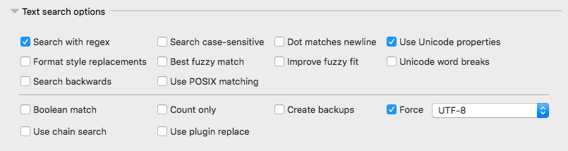
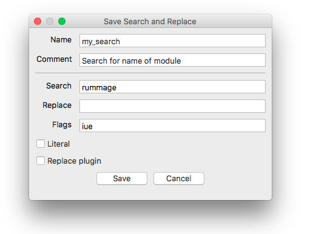
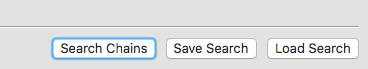
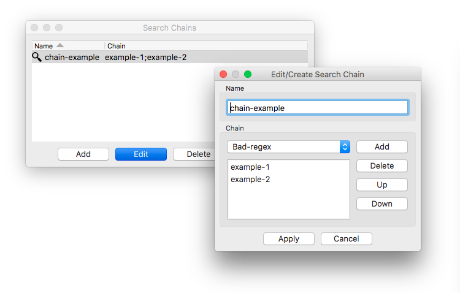
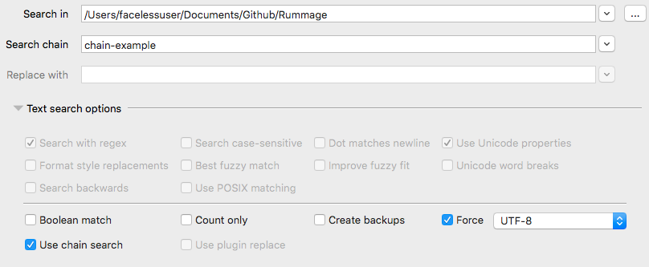
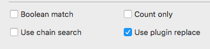

# Basic Usage

## Overview

Rummage is designed to be easy to pick up. Its interface consists of three tabs: Search, Files, and Content.  In the **Search** tab, a user specifies where they want to search, what they want to search for, and optionally what they want to replace it with.  Search features can be tweaked with various options. The files that get searched can also be narrowed with patterns and filters.

Rummage uses the default regular expression library ([Re][re]) that comes with Python. It also optionally works with the 3rd party [Regex][regex] library (if installed).

As matches are found, general info about the matches will be displayed in the **Files** and **Content** tabs. You can double click files to open them in your favorite editor (see [Editor Preferences](./preferences.md#editor) to configure Rummage for your editor).

Rummage also comes with a simple regular expression tester to test out patterns. It also provides a feature where patterns can be saved for later and/or frequent use. You can even create chains that will apply a series of saved searches.

## Running

Once Rummage is installed, you can run it from the command line (assuming your Python scripts/bin folder is in your system path):

```bash
rummage
```

If you have multiple Python versions installed, you can call Rummage for that specific Python version by appending the major and minor Python version to the end:

```bash
rummage3.6
```

In some environments, it may make sense to run Rummage with `pythonw` which is mainly for launching GUI scripts (`pythonw` is not available on Linux). In some environments, it may be required (see [Running in Anaconda](./installation.md#running-in-anaconda)).

```bash
pythonw -m rummage
```

## Searching &amp; Replacing


Search and replaces are configured in the **Search** tab. The search tab can essentially be broken up into two sections: text search configuration and file search configuration.

### Configuring Text Search


The first part of the **Search** tab contains mostly text search inputs, with the exception of the very first control, which is used to configure where to search. The second text box is used to specify what we are searching for in the content of each file. The last text box specified what we want to replace the found text with. Each text box retains a limit history of recent inputs that can be accessed via the drop down control to the right.

The replace text box is only needed if you are performing a replace. The search input can also be omitted, and if so, Rummage will simply return files that match the provided file patterns (covered in [Configuring File Search](#configuring-file-search)).

Below the text boxes is a collapsible panel that contains the text search options. The options consist of various checkboxes and controls that enable/disable search and replace features. The available features will vary depending on which regular expression engine you are using. Each feature is documented in [Search Options](./search.md#search-options).



Lastly, Rummage provides buttons to launch a [regular expression tester](#regular-expression-tester), dialogs to [save or load](#saving-and-loading-regular-expressions) frequently used regular expressions, and a dialog to create and manage [regular expression chains](#search-chains).


### Configuring File Search


The bottom part of the search tab focuses on controlling which files get searched. Various checkboxes and inputs are available that can narrow the actual files that get searched. You can filter out hidden files, symlinks, files of specific sizes, or creation/modification dates.

You can also restrict which files get searched by providing a wild card patterns (or regular expression if preferred). By default, the patterns are applied to the base file or folder name. See [File Patterns](./search.md#wildcard) to learn more about accepted wild card pattern syntax and how to configure optional file pattern features.

!!! tip "Hidden Files"
    Rummage assumes dot files as hidden on all systems. Additionally, on Windows and macOS, it will also look at a
    file's filesystem attributes to determine if the system is potentially hiding the file as well.

!!! new "New 4.4.0"
    Added the symlink following via the **Follow symlinks** toggle.

### Results

Once a search or replace is initiated, the results will begin to appear in the **Files** and **Content** tabs. You can then double click a file to open it in your editor, or right click them to bring up a context menu with additional options.


!!! tip "Column Options"
    You can hide/show columns by right clicking the list header to get a special context menu. You can then deselect or select the the column(s) you wish to hide/show respectively. You can also reorder the columns if desired.

## Regular Expression Tester


Rummage comes with a simple regular expression tester. It has a simple text box to place content to search, and another text box that will show the final results after the find and replace is applied.  Below those text boxes, there are two text input boxes for the find pattern and the replace pattern.  Lastly, all search and replace flag options are found under the patterns.

To use the tester, simply enter the content to search, set your desired options, and input your find and replace pattern.  As you change your pattern or options, matches will be updated and highlighted, and the result box will be updated with any replacements.

When you are satisfied with your result, click the `Use` button, and your pattern and settings will be populated in the main window.

## Saving and Loading Regular Expressions

Regular expressions can be very complex, and sometimes you might want to save them for future use.

When you have a pattern configured that you want to save, simply click the `Save Search` button, and a dialog will pop up asking you to name the search.  When done, click the `Save` button on the dialog and your search patterns and options will be saved.

You'll notice that there are two input boxes. The first requires a unique name (only word characters, underscores, and hyphens are allowed). The second is an optional comment in case you wish to elaborate on what the pattern is for.

Underneath the inputs will be the actual search settings being saved.



To load a pattern that was saved previously, click the `Load Search` button.  You will be presented with a dialog showing all your saved searches.  Highlight the pattern you want to load and click the `Load` button.  Your pattern and options will be populated in the main dialog.

If you wish to edit the name or comment of a search, you can double click the entry or click the "Edit" button.


## Search Chains

There are times you may have a task that requires you to do multiple find and replaces that are all related, but are too difficult to represent as a single find and replace. This is where search chains can be helpful.

Search chains are essentially a sequence of multiple [saved search and replace patterns](#saving-and-loading-regular-expressions). You can create a search chain by clicking the `Search Chains` button which will bring up the search chain manager.



Here you can create or delete search chains.



To use search chains, you must put Rummage in "search chain" mode by selecting the check box named `Use search chains` in the main window. When "search chain" mode is enabled, all controls that don't apply to search chains will be disabled, and the search box will be replaced with a drop down for selecting existing chains you've already created. When a search is performed, Rummage will iterate over each file with all the saved searches in the chain.



## Replace plugins

Regular expressions are great, but sometimes regular expressions aren't enough.  If you are dealing with a replace task that requires logic that cannot be represented in a simple replace pattern, you can create a "replace plugin".

Replace plugins are written in Python and are loaded by first selecting the `Use plugin replace` check box in the main dialog.



Then the main dialog's `Replace with` text box will become the `Replace plugin` text box with an associated file picker.  Here you can point to your replace plugin file.

Replace plugins aren't meant to be full, complex modules that import lots of other relative files.  They are meant to be a single, compact script, but inside that script, you can import anything that is *already* installed in your Python environment.


### Writing a Plugin

Replace plugins should contain two things. The first is a plugin class derived from the `rummage.lib.rumcore.ReplacePlugin` class.  The second is a function called `get_replace` that returns your class.

The plugin class is fairly straight forward and is shown below.

```py3
class ReplacePlugin(object):
    """Rummage replace plugin."""

    def __init__(self, file_info, flags):
        """Initialize."""

        self.file_info = file_info
        self.flags = flags
        self.on_init()

    def on_init(self):
        """Override this function to add initialization setup."""

    def get_flags(self):
        """Get flags."""

        return self.flags

    def get_file_name(self):
        """Get file name."""

        return self.file_info.name

    def is_binary(self):
        """Is a binary search."""

        return self.file_info.encoding.encode == 'bin'

    def is_literal(self):
        """Is a literal search."""

        return self.flags & LITERAL

    def replace(self, m):
        """Make replacement."""

        return m.group(0)
```

`ReplacePlugin`'s `replace` function will receive the parameter `m` which is either a `regex` or `re` match object (depending on what regular expression engine is selected). The return value must be either a Unicode string or byte string (for binary files).

The `ReplacePlugin`'s `file_info` property is a named tuple providing information about the current file such as name, size, creation date, etc.

```py3
class FileInfoRecord(namedtuple('FileInfoRecord', ['id', 'name', 'size', 'modified', 'created', 'encoding'])):
    """A record for tracking file info."""
```

The `ReplacePlugin`'s `flags` property contains only Rummage search related flags (the flags are abstracted at this level and are converted to the appropriate regular expression flags later). They can also be accessed from `rummage.lib.rumcore`. The flags are shown below.

```py3
# Common regular expression flags (re|regex)
IGNORECASE = 0x1  # (?i)
DOTALL = 0x2      # (?s)
MULTILINE = 0x4   # (?m)
UNICODE = 0x8     # (?u)

# Regex module flags
ASCII = 0x10            # (?a)
FULLCASE = 0x20         # (?f)
WORD = 0x40             # (?w)
BESTMATCH = 0x80        # (?b)
ENHANCEMATCH = 0x100    # (?e)
REVERSE = 0x200         # (?r)
VERSION0 = 0x400        # (?V0)
VERSION1 = 0x800        # (?V1)
FORMATREPLACE = 0x1000  # Use {1} for groups in replace
POSIX = 0x2000          # (?p)

# Rumcore search related flags
LITERAL = 0x10000           # Literal search
```

!!! example "Example Plugin"
    In the example below, we have a replace plugin that replaces the search result with the name of the file.  It is assumed this is not a binary replace, so a Unicode string is returned.

    ```py3
    from __future__ import unicode_literals
    from rummage.lib import rumcore
    import os


    class TestReplace(rumcore.ReplacePlugin):
        """Replace object."""

        def replace(self, m):
            """Replace method."""

            name = os.path.basename(self.get_file_name())
            return name


    def get_replace():
        """Get the replace object."""

        return TestReplace
    ```

## Export to CSV or HTML


Rummage allows the exporting of the results to either CSV or HTML.  Simply select **File-->Export** and pick either **CSV** or **HTML**.  The HTML output will be styled similar to the GUI interface with the results in tables with sortable columns.

!!! info "Large Result Sets"
    Really, really large sets of results will probably be best suited for CSV as a browser may have a hard time loading the entire data set at once.

--8<-- "refs.txt"
