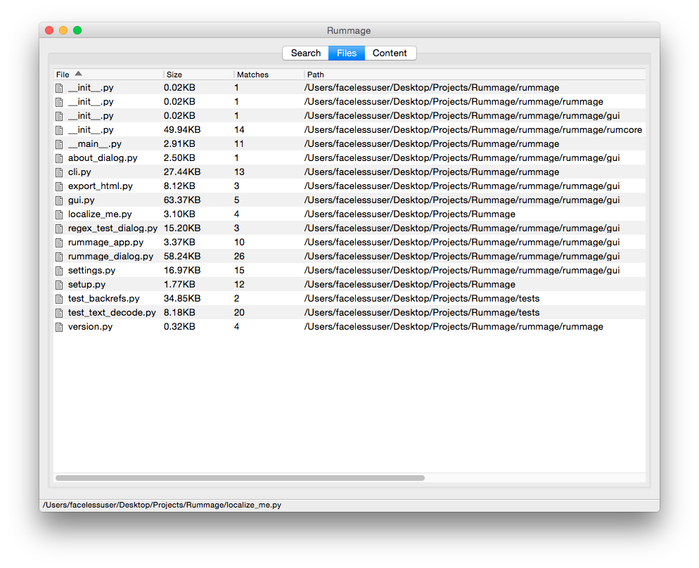
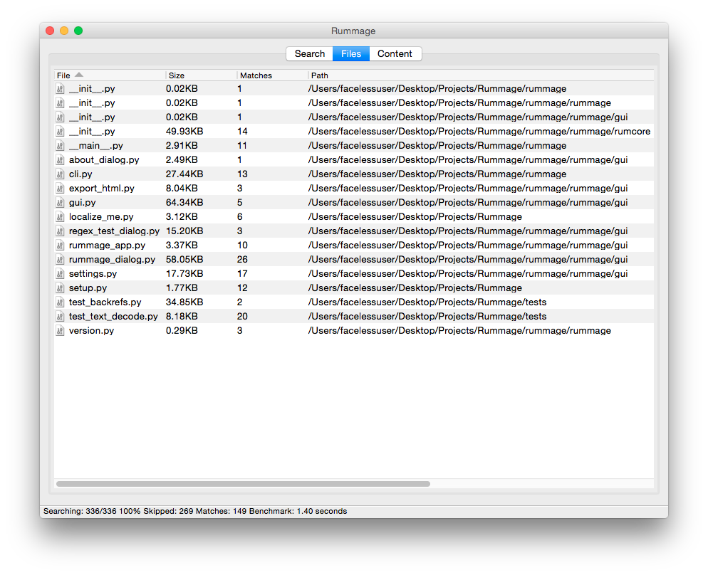
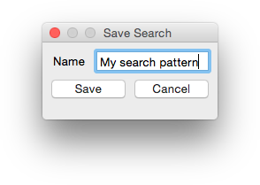
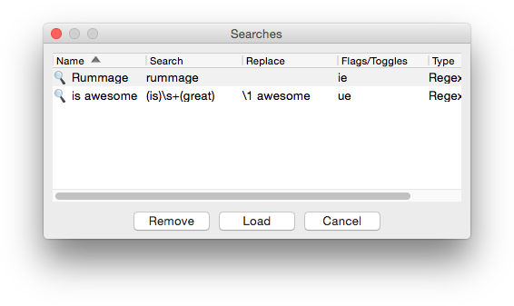
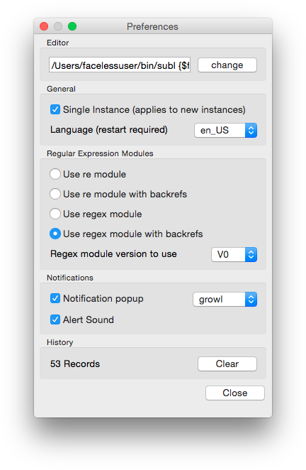

# Using Rummage {: .doctitle}
Detailed usage for rummage.

---

## Overview
Rummage is designed to be easy to pick up. Rummage's interface consists of three tabs: Search, Files, Content.  Each element is labeled to indicate its functionality, and they are grouped with like elements.  In general, a user specifies where they want to search, what they want to search for, and optionally what they want to replace it with.  Search features can be tweaked with toggles, and the scope of what files get searched can be narrowed with filters.  Search options are all contained in the **Search** tab.  When a search has been completed, general info about matches in files will be displayed in the **Files** tab, and more detailed context information will be displayed in the **Content** tab.

Rummage also comes with a simple regex tester to test out patterns.  Rummage also has a feature where patterns can be saved for later and/or frequent use.

At the bottom of the dialog are the search and replace buttons that initiate the search or replace.

The status bar will show search progress, match counts, and other useful information.

!!! caution "Warning: Replace"
    When replacing, Rummage will back up the file in `<your file name>.rum-bak`.  If the copy fails, it should terminate the replace for that file.  You can disable backups if you like, but if you aren't careful with your patterns, you may remove unwanted text that you won't be able to recover unless you use version control.  If using encoding guessing, Rummage *might* guess the wrong encoding causing some things to get lost during replace.  And aside from those issues, something unexpected *could* always occur as well.

    In short, if you disable backups, there is a greater risk as you will no longer have a safety net.  Even with backups, something *could* go wrong.  This is free software, and I am not responsible for files corrupted or lost.  You have been warned.

    Large files, really large files, can possibly cause an issue and may error out as the entire file will be read into memory for a replace.  If you are doing really large files, know that it may error out or get really slow.  Remember this is done in Python, if you are doing massive GB files, maybe you are using the wrong tool for the job.

## Search Tab

The **Search** tab is broken up into 2 panels, the first of which is the **Search &amp; Replace** panel. The **Search &amp; Replace** panel has all the inputs where the search and replace is defined and configured.  It also has access to the regex tester and the save/load dialogs for saving patterns for later use.

The second panel, is the **Limit Search** panel.  The **Limit Search** panel contains toggles and inputs that filter the files to be searched.

## Files Tab

The **Files** tab is where files with matches are shown after a search completes.  The files are arranged in a sortable table.  Each entry will show the files name, file size, number of matches in the file, the file path, detected file encoding, date/time when the file was created, and date/time of when the file was last modified.

When mousing over an entry, the full path to the file will be shown in the status bar.  If you have a editor option in the preference dialog configured properly, you can double click an entry to open the file in your favorite editor.

## Content Tab

The **Content** tab shows each match in a file individually in a sortable table.  Each entry shows the file name, the line on which the match was found, the number of matches on that line, and the the content of the mentioned line.

When mousing over an entry, the full path to the file will be shown in the status bar.  If you have a editor option in the preference dialog configured properly, you can double click an entry to open the file in your favorite editor.

## Search &amp; Replace Panel

The **Search &amp; Replace** panel contains three text boxes with a dropdown history. The first textbox defines **where to search**, the second defines **what to search for**, and the last defines **what to replace matches with**; this is only needed when doing replaces.  You can select previously used patterns and search targets by expanding the dropdown panel for the input.

Below the text boxes are toggles that control the regex engines flags and/or features.  These will vary depending on which regex engine you are using as Rummage can be used with Python's default [**re**](https://docs.python.org/2/library/re.html) engine or the third party [**regex**](https://pypi.python.org/pypi/regex) engine.  Both optionally can use the a special wrapper called **backrefs** to add support for a couple special escapes.

Underneath the regex flags, are toggles for general Rummage search features.  These will alter search and/or replace behavior.

Lastly, Rummage provides buttons to launch a regex test window or to save and load frequently used regular expressions.

### Common Regular Expression Flags
Both the **re** and **regex** engine have a couple of shared flags that are exposed in Rummage. These toggles are found directly under the search and replace text boxes.

| Toggle | Description |
|--------|-------------|
| Search with regex | Alters the behavior of `Search for` and `Replace with`.  When this is checked, both text boxes require regular expression patterns opposed to literal string. |
| Search case-sensitive | Forces the search to be case-sensitive. |
| Dot matches newline | `.` will also match newlines. |
| Use Unicode properties | Changes the behavior of `\w`, `\W`, `\b`, `\B`, `\d`, `\D`, `\s`, and `\S` to use use characters from the Unicode property database (will also modify `\l`, `\L`, `\c`, and `\C` if using **backrefs** with **re**). |

### Regex Engine Flags
If the **regex** engine is being used for regular expressions, a couple of extra toggles will be available.  **Regex** can be run in either `VERSION0` or `VERSION1` mode.  `VERSION0` is compatible with **re** regex patterns and has the extra `fullcase` toggle.  `VERSION1` does not have this toggle as it is enabled by default and can only be disabled inline in a pattern with `(?-f)`.

| Toggle | Description |
|--------|-------------|
| Best fuzzy match | If performing a fuzzy match, the *best* fuzzy match will be used. |
| Improve fuzzy fit | Makes fuzzy matching attempt to improve the fit of the next match that it finds. |
| Unicode word breaks | Will use proper Unicode word breaks when Unicode is enabled.  This differs from **re**'s default. |
| Search backwards | Search backwards. The result of a reverse search is not necessarily the reverse of a forward search. |
| Format style replacements | Replace pattern will use [Python's string replace format](https://docs.python.org/2/library/string.html#format-string-syntax) for replace. `#!python "{1[-1]} {1[-2]} {1[-3]}"` etc. |
| Full case-folding | Use full case folding. Regex `V0` only as it is enabled by default for `V1`. |

### Rummage Flags
Rummage has a couple non

| Toggle | Description |
|--------|-------------|
| Boolean match | Will check each file up until the first match and will then move on.  No line context info will be gathered or displayed. Does not apply to replaces. |
| Count only | Will just count the number of matches in the file, but will not display line context information. This has no effect or replaces. |
| Create backups | On replace, files with matches will be backed up before applying the replacements; backup files will have `.rum-bak` extension. |
| Force &lt;encoding&gt; | Forces all files to be opened with the specified encoding opposed to trying to detect the encoding.  Encoding is hard and slow, so this is the preferred method for fast searches.  On failure, binary will be used instead. |

### Regex Tester

Rummage comes with a simple regex tester.  It has a simple multi-line text box for content to search, and another multi-line box that will show the final results after the find and replace.  Below that you will find two text input boxes for the find pattern and the replace pattern.  Lastly, all related regular expression flag toggles will be found under the patterns.

To use the tester, simply enter the content to search, set your desired toggles, and input your find and replace pattern.  As you change your pattern or change your toggles, matches will automatically highlight, and the result box will be updated.

When you are satisfied with your result, click the `Use` button, and your pattern and settings will be populated in the main window.

### Saving and Loading Regular Expressions
Regular expressions can be very complex, and sometimes you might want to save them for future use to save yourself from having to reconstruct them.

When you have a pattern configured that you want to save, simply click the `Save Search` button, and a dialog will pop up asking you to name the search.  When done, click the `Save` button on the dialog and your search patterns and toggles will be saved.

To load a pattern that was saved previously, click the `Load Search` button.  You will be presented with a dialog showing all your saved searches.  Highlight the pattern you want to load and click the `Load` button.  Your pattern and toggles will be populated in the main dialog.

## Limit Search Panel

The limit search pattern contains inputs and toggles to filter which files will be searched.  Some people may like to set up the filters and hide the panel.  If this is desired, you can select in the windows menu **View-->Hide Limit Search Panel**, and the panel will be hidden.

| Limiter | Description |
|---------|-------------|
| Size of | Limits files that are searched by size in Kilobytes.  Files are limited by whether they are greater than, less than, or equal to the specified size.  Setting the dropdown to `any` essential disables the filter and allows any file size to be searched. It is recommended to cap searches sizes for the best performances.  The more complex the search pattern, the longer it will take to search really large files. |
| Modified | Limits the files to be searched by the modified timestamp.  It contains a date picker and time picker that are used to specify the target date and time. Files are limited by whether their timestamp comes before, after, or on specified date time.  Setting the dropdown to `on any` essential disables the filter and allows a file with any timestamp to be searched. |
| Created | Limits the files to be searched by the creation timestamp.  It contains a date picker and time picker that are used to specify the target date and time. Files are limited by whether their timestamp comes before, after, or on specified date time.  Setting the dropdown to `on any` essential disables the filter and allows a file with any timestamp to be searched. |
| Files which match | Specifies a file pattern for files that should be searched.  Multiple file patterns can be specified with `;` used as a separator. If the Regex toggle to the text box's right is selected, the file pattern must be a regular expression pattern.  You can select previously used patterns by expanding the dropdown panel for the input. |
| Exclude folders | Specifies a directory exclude pattern to filter out folders that are not to be crawled.  Multiple file patterns can be specified with `;` used as a separator.  If the Regex toggle to the text box's right is selected, the file pattern must be a regular expression pattern.  You can select previously used patterns by expanding the dropdown panel for the input. |
| Include subfolders | Indicates that folders should be recursively searched. |
| Include hidden | The given OS's native hidden files, folders and dotfiles will be included in the search. |
| Include binary files | Forces rummage to search binary files. |

## Preferences

The preference dialog (found at **File-->Preferences**) is where Rummage keeps settings that are not frequently accessed.

### Editor
The **Editor** panel is where an editor can be configured that will be used to show files for editing.  To setup, click the `Change` button.  You will be presented with a dialog where you can browse for your editor of choice and manage the arguments to pass to the editor.

### General
The **General** panel contains a couple of useful settings.

Single Instance
: 
    By default, Rummage will allow for multiple windows to be open.  If this option is enabled, the first window will be be the only window to open.  All subsequent instances will pass their arguments to the first and close without showing a window.

Language
: 
    Rummage has internal support to display dialog labels in different languages.  Currently Rummage has English and most of Russian.

### Regular Expression Modules
The **Regular Expression Modules** panel is where the desired regular expression engine that Rummage uses can be selected.  By default, Rummage will use **re**, but if **regex** is installed in your Python installation, it can be selected as well.  There is also the option of using [backrefs](#backrefs) (a wrapper that adds a couple of special escapes) with your engine of choice as well.

If using **regex**, you can set it the version (mode) to use.  `V0` tries to be completely compatible with **re**.  `V1` breaks compatibility with **re** but adds a number of useful additions even over **V0**.

### Notifications
The **Notification** panel controls how (such things as notification results) can be enabled/disabled and configured.  You can enable/disable notification popups and/or audible notification sound.

You can also select whether to use the systems builtin notifications or growl.

### History
The **History** panel is where all text box drop down history can be cleared.

## Backrefs
Rummage has the option of using a special wrapper around Python's **re** or **regex** library called backrefs.  Backrefs was written for use with Rummage and adds various additional backrefs that are known to some regex engines, but not to Python's **re** or **regex**.  The supported back references actually vary depending on the engine being used as one may already have support.  You can enable extended back references in the **Preferences** dialog under the [Regular Expressions Module](#regular-expression-modules) panel.

### Search Back References

For **re**:

| Back&nbsp;References | Description |
| ---------------------|-------------|
| `\c`                 | Uppercase character class.  ASCII or Unicode when re Unicode flag is used.  Can be used in character classes `[]`. |
| `\l`                 | Lowercase character class.  ASCII or Unicode when re Unicode flag is used.  Can be used in character classes `[]`. |
| `\C`                 | Inverse uppercase character class.  ASCII or Unicode when re Unicode flag is used.  Can be used in character classes `[]`. |
| `\L`                 | Inverse lowercase character class.  ASCII or Unicode when re Unicode flag is used.  Can be used in character classes `[]`. |
| `\Q...\E`            | Quotes (escapes) text for regex.  `\E` signifies the end of the quoting. Will be ignored in character classes `[]`. |
| `\p{UnicodeProperty}`| Unicode property character class. Search string must be a Unicode string. Can be used in character classes `[]`. See [Unicode Properties](#unicode-properties) for more info. |
| `\P{UnicodeProperty}`| Inverse Unicode property character class. Search string must be a Unicode string. Can be used in character classes `[]`. See [Unicode Properties](#unicode-properties) for more info. |

For **regex**:

| Back&nbsp;References | Description |
| ---------------------|-------------|
| `\Q...\E`            | Quotes (escapes) text for regex.  `\E` signifies the end of the quoting. Will be ignored in character classes `[]`. |

### Replace Back References
None of the replace back references can be used in character classes `[]`.  These apply to both **re** and **regex**.

| Back&nbsp;References | Description |
| ---------------------|-------------|
| `\c`                 | Uppercase the next character. |
| `\l`                 | Lowercase the next character. |
| `\C...\E`            | Apply uppercase to all characters until either the end of the string or the end marker `\E` is found. |
| `\L...\E`            | Apply lowercase to all characters until either the end of the string or the end marker `\E` is found. |

!!! tip "Tip"
    Complex configurations of casing should work fine.

    - `\L\cTEST\E` --> `Test`
    - `\c\LTEST\E` --> `Test`
    - `\L\cTEST \cTEST\E` --> `Test Test`

### Unicode Properties
Unicode properties can be used with the format: `\p{UnicodeProperty}`.  The inverse can also be used to specify everything not in a Unicode property: `\P{UnicodeProperty}`.  They are only used in the search patterns. You can use either the verbose format or the terse format, but only one property may specified between the curly braces.  If you want to use multiple properties, you can place them in a character class: `[\p{UnicodeProperty}\p{OtherUnicodeProperty}]`.  See the table below to see all the Unicode properties that can be used.

| Verbose&nbsp;Property&nbsp;Form | Terse&nbsp;Property&nbsp;Form |
|---------------------------------|-------------------------------|
| Other | C |
| Control | Cc |
| Format | Cf |
| Surrogate | Cs |
| Private_Use | Co |
| Unassigned | Cn |
| Letter | L |
| Uppercase_Letter | Lu |
| Lowercase_Letter | Ll |
| Titlecase_Letter | Lt |
| Modifier_Letter | Lm |
| Other_Letter | Lo |
| Mark | M |
| Nonspacing_Mark | Mc |
| Spacing_Mark | Me |
| Enclosing_Mark | Md |
| Number | N |
| Decimal_Number | Nd |
| Letter_Number | Nl |
| Other_Number | No |
| Punctuation | P |
| Connector_Punctuation | Pc |
| Dash_Punctuation | Pd |
| Open_Punctuation | Ps |
| Close_Punctuation | Pe |
| Initial_Punctuation | Pi |
| Final_Punctuation | Pf |
| Other_Punctuation | Po |
| Symbol | S |
| Math_Symbol | Sm |
| Currency_Symbol | Sc |
| Modifier_Symbol | Sk |
| Other_Symbol | So |
| Separator | Z |
| Space_Separator | Zs |
| Line_Separator | Zl |
| Paragraph_Separator | Z |
